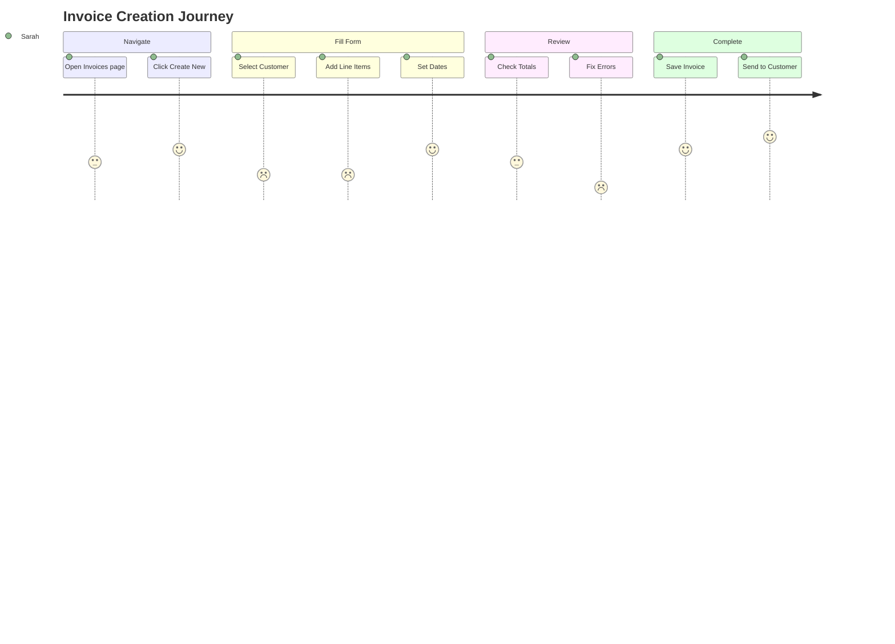

# UX Research -- Validating Design Decisions with Evidence

## 1. User Persona Templates

### Persona Format

```markdown
## Persona: [Name]

**Role**: [Job title / role in the system]
**Department**: [Department]
**Experience Level**: [Novice / Intermediate / Expert]
**Technology Comfort**: [Low / Medium / High]

### Demographics
- Age range: [e.g., 35-45]
- Works at: [Company type / size]
- Uses the system: [Daily / Weekly / Monthly]
- Primary device: [Desktop / Tablet / Mobile]

### Goals
1. [Primary goal — what they need to accomplish]
2. [Secondary goal]
3. [Tertiary goal]

### Pain Points
1. [Frustration or obstacle they face]
2. [Inefficiency in current workflow]
3. [Missing feature or capability]

### Behaviors
- [How they typically work]
- [Tools they currently use]
- [Communication preferences]

### Scenarios
- **Happy path**: [Typical successful workflow]
- **Edge case**: [Unusual but important scenario]
- **Failure recovery**: [What happens when things go wrong]
```

### Example ERP Personas

```markdown
## Persona: Sarah — Accounts Manager

**Role**: Accounts Manager
**Department**: Finance
**Experience Level**: Expert (accounting), Intermediate (software)
**Technology Comfort**: Medium

### Goals
1. Process invoices quickly and accurately
2. Generate month-end financial reports on time
3. Reconcile bank statements without discrepancies

### Pain Points
1. Switching between multiple screens to create a single invoice
2. Report generation takes too long for large date ranges
3. Cannot easily find invoices by partial customer name

### Behaviors
- Processes 30-50 invoices per day
- Prefers keyboard shortcuts over mouse clicks
- Opens multiple browser tabs for cross-referencing
- Prints reports for physical filing

### Scenarios
- **Happy path**: Creates invoice, adds line items, saves, sends to customer via email
- **Edge case**: Customer requests invoice split into two with different PO numbers
- **Failure recovery**: Needs to void and reissue an incorrect invoice after it was sent
```

```markdown
## Persona: Ahmed — Warehouse Supervisor

**Role**: Warehouse Supervisor
**Department**: Inventory / Operations
**Experience Level**: Novice (software), Expert (warehouse)
**Technology Comfort**: Low

### Goals
1. Receive and verify incoming purchase orders
2. Process outgoing deliveries accurately
3. Conduct periodic stock counts

### Pain Points
1. Barcode scanner integration is unreliable
2. Stock adjustment forms require too many fields
3. Cannot quickly see which items are below reorder level

### Behaviors
- Uses a tablet while walking through the warehouse
- Needs large touch targets and simple forms
- Rarely uses keyboard — prefers tapping and scanning
- Works in bright light conditions (needs high contrast)

### Scenarios
- **Happy path**: Scans incoming items, confirms quantities match PO, marks as received
- **Edge case**: Partial delivery — only 80 of 100 items arrived
- **Failure recovery**: Wrong items received — needs to reject and notify procurement
```

---

## 2. Journey Mapping

### Journey Map Template

```markdown
## Journey Map: [Task Name]

**Persona**: [Name]
**Goal**: [What they want to achieve]
**Duration**: [Estimated time]
**Trigger**: [What initiates this journey]

| Stage | Action | Thinking | Feeling | Pain Points | Opportunities |
|-------|--------|----------|---------|-------------|---------------|
| 1. Entry | | | | | |
| 2. Discovery | | | | | |
| 3. Decision | | | | | |
| 4. Action | | | | | |
| 5. Completion | | | | | |
| 6. Follow-up | | | | | |
```

### Example: Invoice Creation Journey

```markdown
## Journey Map: Create and Send Invoice

**Persona**: Sarah (Accounts Manager)
**Goal**: Create an invoice for a completed sales order and send it to the customer
**Duration**: 3-5 minutes
**Trigger**: Sales order marked as delivered

| Stage | Action | Thinking | Feeling | Pain Points | Opportunities |
|-------|--------|----------|---------|-------------|---------------|
| 1. Navigate | Click Invoices > New | "Let me find the create button" | Neutral | Create button not prominent | Add quick-create from dashboard |
| 2. Select Customer | Search and select customer | "Which exact customer entity?" | Slightly anxious | Multiple similar customer names | Show recent/frequent customers first |
| 3. Add Items | Add line items from SO | "I need to match the SO items" | Focused | Manual re-entry of SO items | Auto-populate from sales order |
| 4. Review | Check totals, tax, dates | "Does this look right?" | Careful | Tax calculation not transparent | Show tax breakdown per item |
| 5. Save | Click Save | "Hope it validates" | Hopeful | Validation errors at top, not inline | Inline validation on blur |
| 6. Send | Click Send Email | "Did it go through?" | Relieved | No send confirmation | Show success toast with preview link |
```

### Journey Map Diagram (Mermaid)



---

## 3. Nielsen's Usability Heuristics

### The 10 Heuristics with Enterprise UI Examples

#### 1. Visibility of System Status

The system should always keep users informed about what is going on.

```markdown
**Good Examples:**
- Loading spinner with descriptive text: "Generating report for March 2026..."
- Progress bar during file upload with percentage and estimated time
- Save confirmation toast: "Invoice #INV-042 saved successfully"
- Real-time validation as user types (green checkmark when valid)
- Badge count on pending approvals: "Approvals (3)"

**Bad Examples:**
- Form submits with no loading indicator — user clicks again
- Background job completes with no notification
- Page loads with no skeleton or placeholder content
- Bulk action processes silently with no progress indication
```

#### 2. Match Between System and Real World

Use familiar language, concepts, and conventions from the user's domain.

```markdown
**Good Examples:**
- "Invoice" not "Sales Document Type A"
- "Due Date" not "Payment Deadline Timestamp"
- Currency displayed as "$1,200.00" not "120000" (cents)
- Date format matches user's locale: "Mar 5, 2026" not "2026-03-05"
- Status labels: "Paid", "Overdue", "Draft" — not codes like "S01", "S02"

**Bad Examples:**
- Technical IDs shown to users: "Record UUID: a1b2c3d4..."
- Database column names as field labels: "created_at", "branch_id"
- Error messages with stack traces or SQL errors
```

#### 3. User Control and Freedom

Users often make mistakes. Provide undo, cancel, and escape.

```markdown
**Good Examples:**
- "Undo" option after deleting a record (soft delete with grace period)
- Cancel button on every form (with unsaved changes warning)
- Escape key closes modals and dropdowns
- "Discard Changes" option when navigating away from edited form
- Void/reverse transactions instead of hard delete

**Bad Examples:**
- Permanent deletion without confirmation
- No way to go back in a multi-step wizard
- Auto-saving without undo capability
- Closing a modal loses all form progress
```

#### 4. Consistency and Standards

Follow platform conventions. Same action should look the same everywhere.

```markdown
**Good Examples:**
- Primary action always in the same position (bottom-right of forms)
- Same icon for "edit" across all modules (pencil icon)
- Delete actions always red, always require confirmation
- Date pickers behave identically in every form
- Status badges use consistent colors across modules

**Bad Examples:**
- Save button on the left in one form, right in another
- Different date formats in different modules
- "Delete" button is red in one place, gray in another
- Some tables have pagination, others use infinite scroll
```

#### 5. Error Prevention

Prevent errors from occurring in the first place.

```markdown
**Good Examples:**
- Disable "Submit" until all required fields are filled
- Date picker prevents selecting due date before invoice date
- Quantity field only accepts positive numbers
- Confirmation dialog before irreversible actions
- Autocomplete for customer names to prevent typos
- Show remaining stock when entering order quantities

**Bad Examples:**
- Free-text field for dates (allows invalid formats)
- No validation until form submission
- Allow negative quantities in stock adjustments without warning
- No confirmation before sending invoice to customer
```

#### 6. Recognition Rather Than Recall

Minimize memory load. Make options, actions, and information visible.

```markdown
**Good Examples:**
- Recent customers shown when opening customer selector
- Breadcrumbs showing navigation path
- Tooltips on icon-only buttons
- Search with auto-complete and suggestions
- Dashboard showing recent activity and pending tasks
- Inline help text on complex form fields

**Bad Examples:**
- User must remember customer codes to create invoices
- Navigation requires memorizing URL paths
- Icon-only toolbar with no tooltips
- Error codes without human-readable messages
```

#### 7. Flexibility and Efficiency of Use

Accelerators for experts, simplicity for novices.

```markdown
**Good Examples:**
- Keyboard shortcuts for common actions (Ctrl+S to save)
- Quick search with "/" shortcut
- Bulk actions for power users (select multiple, apply action)
- Recently used items in dropdown lists
- Customizable dashboard widgets
- Saved filter presets for recurring report parameters

**Bad Examples:**
- No keyboard shortcuts at all
- Every action requires multiple clicks through menus
- No way to customize or personalize the interface
- Identical interface for admin and basic user
```

#### 8. Aesthetic and Minimalist Design

Show only relevant information. Remove visual noise.

```markdown
**Good Examples:**
- Clean data tables with only essential columns visible
- Progressive disclosure: show details on click/expand
- Whitespace to separate content groups
- Summary cards with key metrics, details on drill-down
- Collapsible sidebar to maximize content area

**Bad Examples:**
- Dashboard with 20+ KPI cards all visible at once
- Form with 30 fields on a single page (no sections/steps)
- Dense tables with 15+ columns and no ability to hide
- Bright colors and icons competing for attention
```

#### 9. Help Users Recognize, Diagnose, and Recover from Errors

Error messages should be clear, specific, and suggest a fix.

```markdown
**Good Examples:**
- "Customer email is required" (next to the field)
- "Invoice date cannot be in the future. Please select today or earlier."
- "This customer has reached their credit limit ($10,000). Contact the sales manager to increase it."
- Server error: "We couldn't save your invoice. Your changes are preserved — please try again."

**Bad Examples:**
- "Validation failed" (no specifics)
- "Error 422" (meaningless to user)
- "An error occurred" (no recovery path)
- "SQLSTATE[23000]: Integrity constraint violation" (technical detail)
```

#### 10. Help and Documentation

Provide contextual help when needed.

```markdown
**Good Examples:**
- Tooltip on "Payment Terms" field: "Number of days from invoice date until payment is due"
- "What's this?" link next to complex settings
- Contextual help panel in forms
- Searchable help center / knowledge base
- Onboarding tour for first-time users

**Bad Examples:**
- No help text anywhere in the application
- Help documentation is a separate PDF with no search
- Tooltips that repeat the field label verbatim
```

---

## 4. Heuristic Evaluation Checklist

```markdown
## Heuristic Evaluation: [Feature/Page Name]

**Evaluator**: [Name]
**Date**: [Date]
**Device**: [Desktop/Mobile/Tablet]

Rate each heuristic 0-4:
- 0 = No usability problem
- 1 = Cosmetic problem (fix if time allows)
- 2 = Minor problem (low priority fix)
- 3 = Major problem (high priority fix)
- 4 = Usability catastrophe (must fix before release)

| # | Heuristic | Score | Issue | Recommendation |
|---|-----------|-------|-------|----------------|
| 1 | Visibility of system status | | | |
| 2 | Match between system and real world | | | |
| 3 | User control and freedom | | | |
| 4 | Consistency and standards | | | |
| 5 | Error prevention | | | |
| 6 | Recognition rather than recall | | | |
| 7 | Flexibility and efficiency | | | |
| 8 | Aesthetic and minimalist design | | | |
| 9 | Error recovery | | | |
| 10 | Help and documentation | | | |

**Overall Score**: [Sum / 40]
**Critical Issues**: [List severity 3-4 issues]
**Recommendations**: [Prioritized action items]
```

---

## 5. A/B Testing Framework

### Hypothesis Template

```markdown
## A/B Test: [Test Name]

### Hypothesis
**If** we [change/add/remove] [specific UI element],
**then** [metric] will [increase/decrease] by [expected amount],
**because** [reasoning based on research/data].

### Example
**If** we add a "Create from Sales Order" button on the invoice creation page,
**then** invoice creation time will decrease by 30%,
**because** users currently re-enter data from sales orders manually.

### Metrics
- **Primary metric**: Average task completion time
- **Secondary metrics**: Error rate, user satisfaction (post-task survey)
- **Guardrail metrics**: Completion rate (must not decrease)

### Variants
| Variant | Description |
|---------|-------------|
| Control (A) | Current invoice creation form |
| Treatment (B) | Invoice form with "Import from Sales Order" button |

### Sample Size and Duration
- **Minimum sample**: [calculated using power analysis]
- **Duration**: [estimated days to reach sample size]
- **Confidence level**: 95%
- **Minimum detectable effect**: 10%

### Segmentation
- By user role: Accountant vs. Admin
- By branch size: Small (< 50 invoices/month) vs. Large
- By experience: New users (< 30 days) vs. Existing

### Success Criteria
- Treatment shows statistically significant improvement (p < 0.05)
- No negative impact on guardrail metrics
- Qualitative feedback is positive
```

### A/B Test Result Template

```markdown
## A/B Test Results: [Test Name]

**Duration**: [Start date] to [End date]
**Total participants**: [N] (Control: [n1], Treatment: [n2])

### Results

| Metric | Control | Treatment | Difference | p-value | Significant? |
|--------|---------|-----------|------------|---------|-------------|
| Task completion time | 4.2 min | 2.8 min | -33% | 0.002 | Yes |
| Error rate | 8.2% | 5.1% | -3.1pp | 0.041 | Yes |
| Completion rate | 94% | 96% | +2pp | 0.312 | No |

### Decision
[Ship / Iterate / Abandon] — [Reasoning]

### Follow-up
- [Next steps based on results]
```

---

## 6. User Feedback Analysis

### Feedback Classification Framework

```markdown
| Category | Subcategory | Example |
|----------|------------|---------|
| Bug | Functionality | "Save button does not work on Firefox" |
| Bug | Display | "Chart overlaps with sidebar on tablet" |
| Feature Request | New Capability | "I need to export invoices to QuickBooks" |
| Feature Request | Enhancement | "Add bulk status update for invoices" |
| Usability | Navigation | "I cannot find where to manage tax settings" |
| Usability | Clarity | "What does the 'Reconcile' button actually do?" |
| Performance | Speed | "Report generation takes over a minute" |
| Performance | Responsiveness | "Typing in search feels laggy" |
```

### Feedback Prioritization Matrix

```
              High Frequency
                  |
    Quick Wins    |    Must Do
    (P2)          |    (P0/P1)
                  |
  Low ---------|---------> High
  Impact       |          Impact
                  |
    Deprioritize  |    Strategic
    (P3)          |    (P2)
                  |
              Low Frequency
```

### Sentiment Analysis Template

```markdown
## Feedback Summary: [Period]

**Total feedback items**: [N]
**Sources**: In-app feedback, support tickets, user interviews

### Sentiment Distribution
- Positive: [N] ([%])
- Neutral: [N] ([%])
- Negative: [N] ([%])

### Top Themes (by frequency)
1. [Theme] — [N] mentions — [Sample quote]
2. [Theme] — [N] mentions — [Sample quote]
3. [Theme] — [N] mentions — [Sample quote]

### Action Items
| Theme | Severity | Proposed Action | Owner | ETA |
|-------|----------|----------------|-------|-----|
| | | | | |
```

---

## 7. Competitive Analysis Template

```markdown
## Competitive Analysis: [Feature Area]

**Date**: [Date]
**Competitors analyzed**: [List]

### Feature Comparison Matrix

| Feature | Our Product | Competitor A | Competitor B | Competitor C |
|---------|------------|-------------|-------------|-------------|
| Feature 1 | [status] | [status] | [status] | [status] |
| Feature 2 | [status] | [status] | [status] | [status] |

Status key: Full, Partial, None, Planned

### UX Patterns Observed

#### What competitors do well
- [Pattern observed and why it works]

#### What competitors do poorly
- [Pattern observed and why it fails]

### Opportunities
- [Feature or pattern we should adopt]
- [Gap we can exploit]

### Risks
- [Feature where we are behind]
- [Standard expectation we do not meet]
```

---

## 8. Usability Testing Script

```markdown
## Usability Test Script: [Feature]

### Introduction (2 min)
"Thank you for participating. We are testing our [feature], not you.
There are no right or wrong answers. Please think aloud as you work
through the tasks — tell us what you are looking at, what you expect
to happen, and any confusion you encounter."

### Warm-up Questions (3 min)
1. What is your role?
2. How often do you [relevant task]?
3. What tools do you currently use for this?

### Tasks (15-20 min)

**Task 1: [Task Name]**
Scenario: "[Realistic scenario description]"
Success criteria: [What constitutes completion]
Time limit: [Expected time + buffer]

Observe:
- [ ] Did they find the starting point?
- [ ] Did they understand the labels/buttons?
- [ ] Did they encounter any errors?
- [ ] Did they complete the task?
- [ ] Time to completion: ___

**Task 2: [Task Name]**
...

### Post-Task Questions (5 min)
1. On a scale of 1-7, how easy was this task? (Single Ease Question)
2. What was the most confusing part?
3. What would you change?
4. Is there anything missing that you expected to find?

### SUS Questionnaire (3 min)
[Administer System Usability Scale — 10 questions]

### Wrap-up (2 min)
"Is there anything else you would like to share about your experience?"
```

---

## 9. Task Success Metrics

### Key Metrics

| Metric | Definition | Target |
|--------|-----------|--------|
| Task completion rate | % of users who complete the task | > 90% |
| Time on task | Average time to complete | Varies by task |
| Error rate | % of users who make at least one error | < 10% |
| Error frequency | Average errors per task | < 0.5 |
| Learnability | Improvement from attempt 1 to attempt 3 | > 30% faster |
| Single Ease Question (SEQ) | Post-task ease rating (1-7) | > 5.5 |

### System Usability Scale (SUS)

10 alternating positive/negative statements, rated 1-5 (Strongly Disagree to Strongly Agree):

1. I think that I would like to use this system frequently.
2. I found the system unnecessarily complex.
3. I thought the system was easy to use.
4. I think that I would need the support of a technical person to use this system.
5. I found the various functions in this system were well integrated.
6. I thought there was too much inconsistency in this system.
7. I would imagine that most people would learn to use this system very quickly.
8. I found the system very cumbersome to use.
9. I felt very confident using the system.
10. I needed to learn a lot of things before I could get going with this system.

**Scoring**: For odd items, subtract 1 from score. For even items, subtract score from 5. Sum all scores and multiply by 2.5. Result is 0-100.

| Score | Grade | Interpretation |
|-------|-------|---------------|
| 80-100 | A | Excellent |
| 68-79 | B | Good |
| 50-67 | C | Needs improvement |
| < 50 | F | Unacceptable |

---

## 10. Information Architecture Methods

### Card Sorting

Use to determine how users expect content to be organized.

```markdown
## Card Sort: [Module/Feature]

**Method**: [Open / Closed / Hybrid]
**Participants**: [N] users from [roles]
**Cards**: [N] items representing pages/features

### Open Sort Results
| Group Name (user-created) | Cards Included | Frequency |
|--------------------------|----------------|-----------|
| [Group] | [Cards] | [N of N participants] |

### Similarity Matrix (top groupings)
Items frequently grouped together:
- Invoice + Credit Note + Payment (85%)
- Customer + Quotation + Sales Order (78%)
- Product + Warehouse + Stock Movement (92%)

### Recommended Navigation
Based on sort results, the recommended grouping is: [...]
```

### Tree Testing

Use to validate navigation structure (reverse card sort).

```markdown
## Tree Test: [Navigation Structure]

**Participants**: [N]
**Tasks**: [N]

### Results

| Task | Correct Path | Success Rate | Directness | Avg Time |
|------|-------------|-------------|------------|----------|
| Find overdue invoices | Accounting > Invoices > Filter | 82% | 65% | 18s |
| Add a new product | Inventory > Products > Create | 91% | 88% | 12s |
| View employee leave balance | HR > Leave > Balance | 68% | 45% | 28s |

### Findings
- HR > Leave navigation was not intuitive — users looked under "Employees" first
- Recommendation: Add "Leave Balance" as a sub-item under Employees as well
```

---

## 11. Analytics-Driven UX Insights

### Key Analytics to Track

| Metric | Tool | Insight |
|--------|------|---------|
| Page views / session | Analytics | Most/least used features |
| Bounce rate per page | Analytics | Pages that confuse users |
| Feature adoption | Analytics | New feature engagement |
| Time on page | Analytics | Complex vs. simple pages |
| Click heatmaps | Heatmap tool | Where users click (and miss) |
| Scroll depth | Heatmap tool | Content visibility |
| Session recordings | Session replay | Actual user behavior |
| Funnel completion | Analytics | Drop-off points in workflows |
| Search queries | Internal search | What users cannot find |
| Error page hits | Analytics | Broken user journeys |

### Funnel Analysis Template

```markdown
## Funnel: [Workflow Name]

| Step | Description | Users | Drop-off | Drop-off % |
|------|------------|-------|----------|-----------|
| 1 | Open create form | 1,000 | — | — |
| 2 | Fill required fields | 920 | 80 | 8% |
| 3 | Add line items | 850 | 70 | 7.6% |
| 4 | Submit form | 780 | 70 | 8.2% |
| 5 | Confirmation | 770 | 10 | 1.3% |

**Overall conversion**: 77%
**Biggest drop-off**: Step 2 (filling required fields) — investigate which fields cause abandonment
```

### UX Dashboard Metrics

Track these metrics on a recurring basis to monitor UX health:

```markdown
## Monthly UX Scorecard

| Metric | This Month | Last Month | Trend | Target |
|--------|-----------|------------|-------|--------|
| Task completion rate | 88% | 85% | Up | > 90% |
| Avg. SUS score | 72 | 70 | Up | > 75 |
| Support tickets (UX) | 23 | 31 | Down | < 20 |
| Feature adoption (new) | 34% | — | New | > 40% |
| Error rate (forms) | 6% | 8% | Down | < 5% |
| Avg. time on task | 3.2m | 3.8m | Down | < 3m |
```
