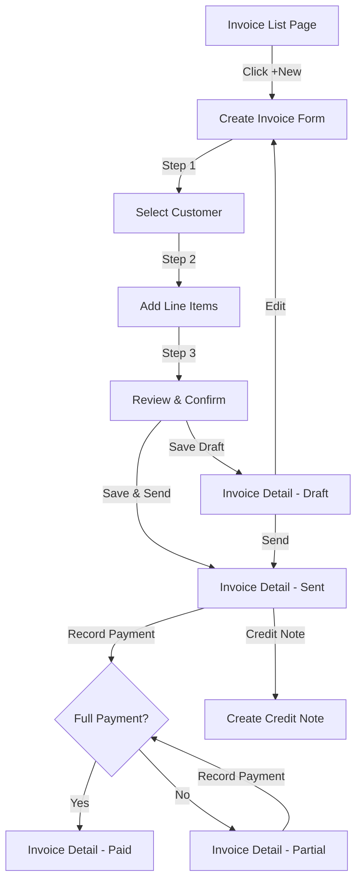
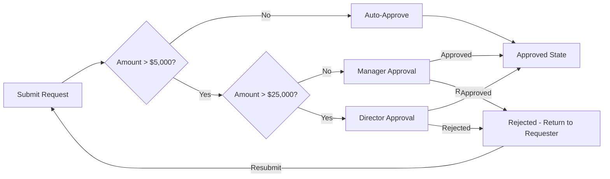
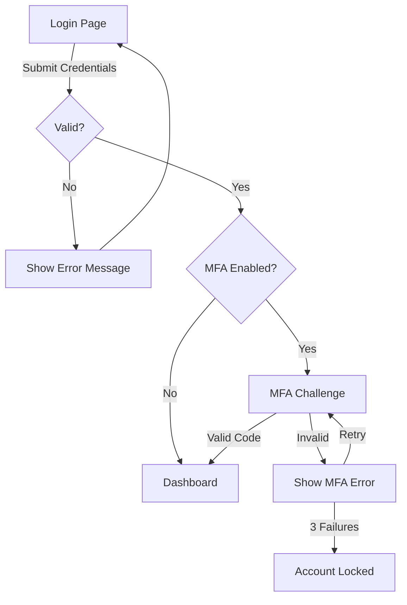

# Wireframing and Prototyping -- Planning UI Before Code

## 1. Low-Fidelity Wireframes (ASCII / Markdown)

Use ASCII wireframes for rapid communication during planning phases. They focus on layout and content hierarchy without visual distractions.

### Dashboard Layout

```
+----------------------------------------------------------+
| [Logo]  Dashboard    Invoices    Inventory    HR    [User] |
+----------+-----------------------------------------------+
|          |  Breadcrumb: Home > Dashboard                  |
| SIDEBAR  |                                                |
|          |  +----------+ +----------+ +----------+ +----+ |
| Dashboard|  | Revenue  | | Expenses | | Profit   | |Due | |
| Invoices |  | $124,500 | | $87,200  | | $37,300  | |12  | |
| Products |  | +8.2%    | | +3.1%    | | +15.4%   | |inv | |
| Customers|  +----------+ +----------+ +----------+ +----+ |
| Reports  |                                                |
|          |  +-------------------------+ +---------------+ |
| SECTION  |  | Revenue Chart           | | Recent        | |
| -------- |  |                         | | Activity      | |
| Settings |  | [Line chart area]       | | - Inv #1042   | |
| Users    |  |                         | | - PO #892     | |
| Branches |  |                         | | - Leave req   | |
|          |  +-------------------------+ +---------------+ |
|          |                                                |
|          |  +-------------------------------------------+ |
|          |  | Recent Invoices                    [+New]  | |
|          |  |-------------------------------------------| |
|          |  | #  | Customer    | Date   | Amount | Stat | |
|          |  | 42 | Acme Corp   | Mar 5  | $1,200 | Paid | |
|          |  | 41 | Globex Inc  | Mar 4  | $3,400 | Due  | |
|          |  | 40 | Initech     | Mar 3  | $890   | Over | |
|          |  +-------------------------------------------+ |
+----------+-----------------------------------------------+
```

### List Page (Index)

```
+----------------------------------------------------------+
| Invoices                                          [+New]  |
+----------------------------------------------------------+
| [Search...............] [Status: All v] [Date: This Mo v] |
| [Export CSV] [Export PDF]                                  |
+----------------------------------------------------------+
| [ ] | #     | Customer     | Date    | Due Date | Amount  |
| --- | ----- | ------------ | ------- | -------- | ------- |
| [ ] | INV-42| Acme Corp    | Mar 5   | Apr 5    | $1,200  |
| [ ] | INV-41| Globex Inc   | Mar 4   | Apr 4    | $3,400  |
| [ ] | INV-40| Initech      | Mar 3   | Apr 3    | $890    |
| [ ] | INV-39| Wayne Ent    | Mar 2   | Apr 2    | $5,100  |
+----------------------------------------------------------+
| Showing 1-25 of 142         [< 1 2 3 4 5 ... 6 >]       |
+----------------------------------------------------------+
| Selected: 2 items   [Delete] [Mark as Sent] [Download]   |
+----------------------------------------------------------+
```

### Detail Page

```
+----------------------------------------------------------+
| < Back to Invoices                                        |
+----------------------------------------------------------+
| Invoice #INV-042                    Status: [Paid]        |
| Customer: Acme Corp                                       |
| Date: March 5, 2026    Due: April 5, 2026                |
+----------------------------------------------------------+
| [Edit] [Send Email] [Download PDF] [Print] [More... v]   |
+----------------------------------------------------------+
|                                                           |
| ITEMS                                                     |
| +-------------------------------------------------------+|
| | Product         | Qty | Unit Price | Tax  | Total     ||
| | Widget A        |  10 | $50.00     | 5%   | $525.00   ||
| | Service Plan B  |   1 | $675.00    | 5%   | $708.75   ||
| +-------------------------------------------------------+|
|                              Subtotal:    $1,175.00       |
|                              Tax (5%):       $58.75       |
|                              TOTAL:       $1,233.75       |
|                                                           |
+----------------------------+-----------------------------+
| PAYMENT HISTORY            | ACTIVITY LOG                |
| Mar 15 - $1,233.75 (Full) | Mar 5 - Created by John     |
|   Ref: CHQ-8842           | Mar 5 - Sent via email      |
|                            | Mar 15 - Payment received   |
+----------------------------+-----------------------------+
```

### Form Page (Create/Edit)

```
+----------------------------------------------------------+
| Create Invoice                                            |
+----------------------------------------------------------+
|                                                           |
| STEP 1: Customer Details                 [1] [2] [3] [4] |
| -------------------------------------------------------- |
|                                                           |
| Customer *        [Select customer...          v]         |
|                                                           |
| Invoice Date *    [2026-03-06        ] [cal]              |
| Due Date *        [2026-04-06        ] [cal]              |
|                                                           |
| Reference #       [PO-2026-0042                ]          |
|                                                           |
| Notes             [                              ]        |
|                   [                              ]        |
|                                                           |
| LINE ITEMS                                                |
| +-------------------------------------------------------+|
| | Product *     | Qty *  | Price *  | Tax    | Total    ||
| | [Select... v] | [    ] | [      ] | [5% v] | $0.00   ||
| | [Select... v] | [    ] | [      ] | [5% v] | $0.00   ||
| | [+ Add Line Item]                                     ||
| +-------------------------------------------------------+|
|                              Subtotal:    $0.00           |
|                              Tax:         $0.00           |
|                              Total:       $0.00           |
|                                                           |
| [Cancel]                    [Save Draft] [Save & Send]    |
+----------------------------------------------------------+
```

### Multi-Step Wizard

```
+----------------------------------------------------------+
| Create Purchase Order                                     |
+----------------------------------------------------------+
| (1) Vendor  -->  (2) Items  -->  (3) Terms  -->  (4) Review |
|   [done]          [active]        [pending]       [pending]  |
+----------------------------------------------------------+
|                                                           |
| STEP 2: Select Items                                      |
|                                                           |
| Search products: [...........................]             |
|                                                           |
| +-------------------------------------------------------+|
| | [ ] | SKU     | Product          | In Stock | Price   ||
| | [x] | PRD-101 | Widget A         | 42       | $50.00  ||
| | [ ] | PRD-102 | Widget B         | 18       | $75.00  ||
| | [x] | PRD-103 | Gadget C         | 0 (!)    | $120.00 ||
| +-------------------------------------------------------+|
|                                                           |
| Selected items (2):                                       |
| Widget A    Qty: [10  ]  = $500.00                       |
| Gadget C    Qty: [5   ]  = $600.00                       |
|                                                           |
| [< Back]                                      [Next >]   |
+----------------------------------------------------------+
```

---

## 2. Page Layout Patterns

### Common Enterprise Layouts

#### Shell Layout (App Container)

```
+---------+------------------------------------------------+
| Sidebar | Header (breadcrumb + actions + user + branch)  |
|         +------------------------------------------------+
|  Nav    |                                                |
|  items  |  Main Content Area                             |
|         |                                                |
|         |  - Page title + actions                        |
|         |  - Filters / toolbar                           |
|         |  - Content (table, form, cards)                |
|         |  - Pagination                                  |
|         |                                                |
+---------+------------------------------------------------+
```

#### Split View (Master-Detail)

```
+---------+--------------------+---------------------------+
| Sidebar | Master List        | Detail Panel              |
|         | [Search.........]  |                           |
|         | > Item 1           | Item 2 Details            |
|         | * Item 2 (active)  | -----------------         |
|         | > Item 3           | Field: Value              |
|         | > Item 4           | Field: Value              |
|         |                    |                           |
|         |                    | [Actions...]              |
+---------+--------------------+---------------------------+
```

#### Full-Width Report

```
+---------+------------------------------------------------+
| Sidebar | Report: Sales Summary                          |
|         +------------------------------------------------+
|         | Branch: [All v]  Period: [Mar 2026 v]  [Run]   |
|         +------------------------------------------------+
|         | +--------+ +--------+ +--------+ +--------+   |
|         | |Total   | |Invoiced| |Received| |Pending |   |
|         | |$48,200 | |$42,100 | |$35,800 | |$6,300  |   |
|         | +--------+ +--------+ +--------+ +--------+   |
|         |                                                |
|         | [======== Revenue Chart ==================]    |
|         |                                                |
|         | +--------------------------------------------+ |
|         | | Breakdown by Customer      [Export] [Print] | |
|         | |--------------------------------------------| |
|         | | Customer    | Invoiced | Paid    | Balance | |
|         | | Acme Corp   | $12,400  | $10,200 | $2,200  | |
|         | +--------------------------------------------+ |
+---------+------------------------------------------------+
```

---

## 3. Information Architecture

### Navigation Hierarchy

```
ERP Application
|
+-- Dashboard
|
+-- Accounting
|   +-- Invoices (CRUD + send + payment)
|   +-- Bills (CRUD + payment)
|   +-- Journal Entries
|   +-- Chart of Accounts
|   +-- Bank Reconciliation
|   +-- Reports
|       +-- Trial Balance
|       +-- Profit & Loss
|       +-- Balance Sheet
|       +-- Cash Flow
|
+-- Inventory
|   +-- Products (CRUD)
|   +-- Warehouses
|   +-- Stock Movements
|   +-- Stock Adjustments
|   +-- Reports
|       +-- Stock Levels
|       +-- Stock Valuation
|
+-- Sales
|   +-- Customers (CRUD)
|   +-- Quotations (CRUD + convert)
|   +-- Sales Orders (CRUD + fulfill)
|   +-- Delivery Notes
|   +-- Reports
|       +-- Sales by Customer
|       +-- Aging Report
|
+-- Procurement
|   +-- Vendors (CRUD)
|   +-- Purchase Requests (CRUD + approve)
|   +-- Purchase Orders (CRUD + receive)
|   +-- Reports
|
+-- HR
|   +-- Employees (CRUD)
|   +-- Attendance
|   +-- Leave Management
|   +-- Payroll
|   +-- Reports
|
+-- Settings
    +-- Company
    +-- Branches
    +-- Users & Roles
    +-- Tax Configuration
    +-- Document Numbering
    +-- Email Templates
```

### Breadcrumb Pattern

```
Home > Accounting > Invoices                     (list page)
Home > Accounting > Invoices > INV-042           (detail page)
Home > Accounting > Invoices > Create            (create page)
Home > Accounting > Invoices > INV-042 > Edit    (edit page)
Home > HR > Employees > John Doe > Leave History (nested detail)
```

---

## 4. User Flow Diagrams (Mermaid)

### Invoice Creation Flow



### Approval Workflow



### User Authentication Flow



---

## 5. Responsive Layout Planning

### Breakpoint Strategy

| Breakpoint | Width | Layout Changes |
|------------|-------|----------------|
| Mobile | < 640px | Single column, hamburger nav, cards instead of tables |
| Tablet | 640-1023px | Sidebar collapses, 2-column grid |
| Desktop | 1024-1279px | Full sidebar, 3-column grids |
| Wide | 1280px+ | Full layout, max content width 1280px |

### Responsive Data Table Strategy

```
DESKTOP (>= 1024px):
+--------------------------------------------------+
| #  | Customer    | Date   | Amount | Status | ... |
|----|-------------|--------|--------|--------|-----|
| 42 | Acme Corp   | Mar 5  | $1,200 | Paid   | ...|
+--------------------------------------------------+

MOBILE (< 640px):
+---------------------------+
| Invoice #INV-042          |
| Acme Corp                 |
| Mar 5, 2026               |
| $1,200.00        [Paid]   |
+---------------------------+
| Invoice #INV-041          |
| Globex Inc                |
| Mar 4, 2026               |
| $3,400.00        [Due]    |
+---------------------------+
```

### Mobile Navigation

```
DESKTOP:
+---------+--------------------------------------+
| Sidebar | Content                              |
| (fixed) |                                      |
+---------+--------------------------------------+

MOBILE:
+--------------------------------------------+
| [=] Logo        Branch: Dubai     [Avatar] |
+--------------------------------------------+
| Content (full width)                       |
+--------------------------------------------+

[=] opens overlay sidebar
```

---

## 6. Interaction Design

### Hover and Focus States

```
Button States:
  Default:  bg-blue-600, text-white
  Hover:    bg-blue-700, cursor-pointer
  Active:   bg-blue-800, scale-[0.98]
  Focus:    ring-2 ring-blue-500 ring-offset-2
  Disabled: bg-gray-300, cursor-not-allowed, opacity-50
  Loading:  spinner icon, pointer-events-none

Input States:
  Default:  border-gray-300
  Hover:    border-gray-400
  Focus:    border-blue-500, ring-1 ring-blue-500
  Error:    border-red-500, ring-1 ring-red-500
  Disabled: bg-gray-100, text-gray-500
  Readonly: bg-gray-50, cursor-default
```

### Transition Specifications

| Element | Property | Duration | Easing |
|---------|----------|----------|--------|
| Button hover | background-color | 150ms | ease |
| Modal open | opacity + transform | 200ms | ease-out |
| Modal close | opacity + transform | 150ms | ease-in |
| Sidebar toggle | width | 200ms | ease-in-out |
| Dropdown open | opacity + transform | 150ms | ease-out |
| Toast enter | transform (slide-in) | 300ms | ease-out |
| Toast exit | opacity | 200ms | ease-in |
| Skeleton pulse | opacity | 1500ms | infinite ease-in-out |

### Micro-Animation Patterns

```css
/* Skeleton loading pulse */
@keyframes pulse {
  0%, 100% { opacity: 1; }
  50% { opacity: 0.5; }
}
.skeleton { animation: pulse 1.5s ease-in-out infinite; }

/* Slide-in for toasts */
@keyframes slide-in-right {
  from { transform: translateX(100%); opacity: 0; }
  to { transform: translateX(0); opacity: 1; }
}

/* Fade for modals */
@keyframes fade-in {
  from { opacity: 0; }
  to { opacity: 1; }
}

/* Scale for modal content */
@keyframes scale-in {
  from { transform: scale(0.95); opacity: 0; }
  to { transform: scale(1); opacity: 1; }
}
```

---

## 7. Screen Inventory Template

Use this template to plan all screens before implementation.

```markdown
## Screen Inventory: [Module Name]

| # | Screen | Route | Type | Priority | Status |
|---|--------|-------|------|----------|--------|
| 1 | Invoice List | /invoices | Index | P0 | Planned |
| 2 | Invoice Detail | /invoices/:id | Detail | P0 | Planned |
| 3 | Create Invoice | /invoices/create | Form (wizard) | P0 | Planned |
| 4 | Edit Invoice | /invoices/:id/edit | Form | P1 | Planned |
| 5 | Invoice PDF Preview | /invoices/:id/pdf | Preview | P1 | Planned |
| 6 | Invoice Reports | /invoices/reports | Report | P2 | Planned |

### Screen Details

#### 1. Invoice List
- **Purpose**: View, search, filter, and manage all invoices
- **Data**: Paginated invoice list (25/page)
- **Filters**: Status, date range, customer, amount range
- **Actions**: Create, bulk delete, bulk send, export
- **Mobile**: Card layout replaces table
- **Empty state**: Illustration + "Create your first invoice" CTA
```

---

## 8. Common Enterprise UI Patterns

### Data Table with Filters and Bulk Actions

Key features:
- Column-level sorting (click header)
- Global search with debounce (300ms)
- Filter bar with dropdowns (status, date range, category)
- Row selection via checkboxes
- Bulk action bar appears when items are selected
- Export buttons (CSV, PDF)
- Pagination with page size selector
- Empty state with contextual message
- Loading skeleton rows

### Filter Panel Pattern

```
+-------------------------------------------------+
| Filters                              [Clear All] |
+-------------------------------------------------+
| Status:    [All v]  [Draft] [Sent] [Paid] [Due] |
| Customer:  [Select customer...              v]   |
| Date From: [2026-01-01     ]                     |
| Date To:   [2026-03-06     ]                     |
| Amount:    [Min......] to [Max......]            |
+-------------------------------------------------+
| Applied: Status=Paid, Date=Jan-Mar 2026  [x][x] |
+-------------------------------------------------+
```

### Empty State Pattern

```
+-----------------------------------------------+
|                                               |
|           [Illustration/Icon]                 |
|                                               |
|         No invoices found                     |
|                                               |
|   You haven't created any invoices yet.       |
|   Start by creating your first invoice.       |
|                                               |
|         [+ Create Invoice]                    |
|                                               |
+-----------------------------------------------+
```

### Confirmation Dialog Pattern

```
+---------------------------------------+
| Delete Invoice                    [x] |
+---------------------------------------+
|                                       |
| Are you sure you want to delete       |
| Invoice #INV-042?                     |
|                                       |
| This action cannot be undone. The     |
| invoice and all associated payments   |
| will be permanently removed.          |
|                                       |
|           [Cancel]  [Delete]          |
+---------------------------------------+
```

---

## 9. Prototype Documentation Format

```markdown
## Prototype: [Feature Name]

### Overview
Brief description of the feature and its purpose.

### User Stories
- As a [role], I want to [action] so that [benefit].

### Screens
1. **[Screen Name]** - Description
   - Entry points: How users get here
   - Key interactions: What users can do
   - Exit points: Where users go next
   - Wireframe: (ASCII or link)

### Data Requirements
- API endpoints needed
- Data fields displayed
- Validation rules

### Edge Cases
- Empty state (no data)
- Error state (API failure)
- Loading state
- Permission denied
- Concurrent edit conflict

### Open Questions
- [ ] Question 1
- [ ] Question 2
```
