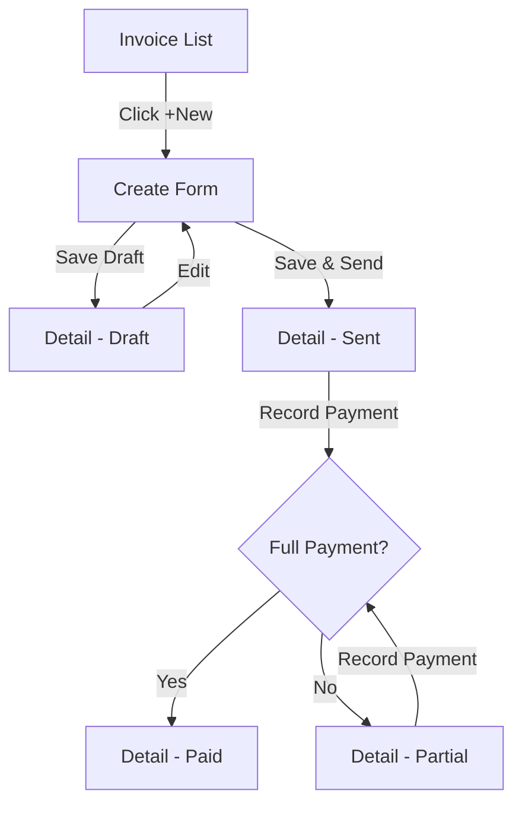
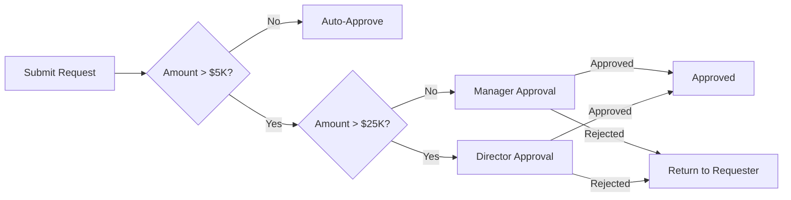

# Wireframing and Prototyping -- Planning UI Before Code

## Low-Fidelity Wireframes (ASCII)

### Dashboard
```
+----------------------------------------------------------+
| [Logo]  Dashboard    Invoices    Inventory    HR    [User] |
+----------+-----------------------------------------------+
|          |  +----------+ +----------+ +----------+ +----+ |
| SIDEBAR  |  | Revenue  | | Expenses | | Profit   | |Due | |
| Dashboard|  | $124,500 | | $87,200  | | $37,300  | |12  | |
| Invoices |  +----------+ +----------+ +----------+ +----+ |
| Products |                                                |
| Customers|  +-------------------------+ +---------------+ |
| Reports  |  | Revenue Chart           | | Recent        | |
| Settings |  | [Line chart area]       | | Activity      | |
|          |  +-------------------------+ +---------------+ |
|          |  +-------------------------------------------+ |
|          |  | Recent Invoices                    [+New]  | |
|          |  | #  | Customer    | Date   | Amount | Stat | |
|          |  | 42 | Acme Corp   | Mar 5  | $1,200 | Paid | |
|          |  +-------------------------------------------+ |
+----------+-----------------------------------------------+
```

### List Page
```
+----------------------------------------------------------+
| Invoices                                          [+New]  |
| [Search...............] [Status: All v] [Date: This Mo v] |
| [ ] | #     | Customer     | Date    | Amount  | Status  |
| [ ] | INV-42| Acme Corp    | Mar 5   | $1,200  | Paid    |
| Showing 1-25 of 142         [< 1 2 3 ... 6 >]           |
| Selected: 2 items   [Delete] [Mark as Sent] [Download]   |
+----------------------------------------------------------+
```

### Form Page (Create/Edit)
```
+----------------------------------------------------------+
| Create Invoice                          [1] [2] [3] [4]  |
| Customer *        [Select customer...          v]         |
| Invoice Date *    [2026-03-06        ] [cal]              |
| Due Date *        [2026-04-06        ] [cal]              |
| LINE ITEMS                                                |
| | Product *     | Qty *  | Price *  | Tax    | Total    ||
| | [Select... v] | [    ] | [      ] | [5% v] | $0.00   ||
| | [+ Add Line Item]                                     ||
|                              Subtotal:    $0.00           |
| [Cancel]                    [Save Draft] [Save & Send]    |
+----------------------------------------------------------+
```

## Page Layout Patterns

**Shell**: Sidebar (nav) + Header (breadcrumb, actions, user, branch) + Main content area.
**Split View (Master-Detail)**: List on left, detail panel on right.
**Full-Width Report**: Filters bar, KPI cards, chart, breakdown table.

## Information Architecture

```
ERP Application
+-- Dashboard
+-- Accounting (Invoices, Bills, Journal Entries, Chart of Accounts, Bank Reconciliation, Reports)
+-- Inventory (Products, Warehouses, Stock Movements, Adjustments, Reports)
+-- Sales (Customers, Quotations, Sales Orders, Delivery Notes, Reports)
+-- Procurement (Vendors, Purchase Requests, Purchase Orders, Reports)
+-- HR (Employees, Attendance, Leave, Payroll, Reports)
+-- Settings (Company, Branches, Users & Roles, Tax, Document Numbering)
```

Breadcrumbs: `Home > Module > List > Detail > Action`

## User Flow Diagrams (Mermaid)





## Responsive Strategy

| Breakpoint | Width | Changes |
|------------|-------|---------|
| Mobile | < 640px | Single column, hamburger nav, cards replace tables |
| Tablet | 640-1023px | Collapsible sidebar, 2-column grid |
| Desktop | 1024-1279px | Full sidebar, 3-column grids |
| Wide | 1280px+ | Full layout, max-width 1280px |

Mobile data tables convert to stacked cards:
```
+---------------------------+
| Invoice #INV-042          |
| Acme Corp                 |
| Mar 5, 2026               |
| $1,200.00        [Paid]   |
+---------------------------+
```

## Interaction States

```
Button:  Default -> Hover (bg-darker) -> Active (scale-0.98) -> Focus (ring-2) -> Disabled (opacity-50) -> Loading (spinner)
Input:   Default (border-gray-300) -> Hover (border-gray-400) -> Focus (border-blue-500 ring-1) -> Error (border-red-500) -> Disabled (bg-gray-100)
```

| Element | Property | Duration | Easing |
|---------|----------|----------|--------|
| Button hover | background | 150ms | ease |
| Modal open/close | opacity + transform | 200ms/150ms | ease-out/ease-in |
| Sidebar toggle | width | 200ms | ease-in-out |
| Toast enter/exit | transform/opacity | 300ms/200ms | ease-out/ease-in |

## Enterprise UI Patterns

**Data Table**: Column sorting, debounced search (300ms), filter bar, row checkboxes, bulk action bar, export CSV/PDF, pagination with page-size selector, empty/loading states.

**Filter Panel**: Status chips, customer dropdown, date range pickers, amount range, "Clear All" button, applied filter tags with dismiss.

**Empty State**: Icon/illustration + descriptive message + primary CTA button.

**Confirmation Dialog**: Title, consequence description, Cancel + Destructive action buttons.

## Screen Inventory Template

```
| # | Screen | Route | Type | Priority |
|---|--------|-------|------|----------|
| 1 | Invoice List | /invoices | Index | P0 |
| 2 | Invoice Detail | /invoices/:id | Detail | P0 |
| 3 | Create Invoice | /invoices/create | Form (wizard) | P0 |

Per screen: Purpose, Data (API + fields), Filters, Actions, Mobile adaptation, Empty state.
```

## Prototype Documentation Format

```
## Prototype: [Feature Name]
### Overview: Brief description.
### User Stories: As a [role], I want to [action] so that [benefit].
### Screens: Entry points, key interactions, exit points, wireframe.
### Data Requirements: API endpoints, fields, validation.
### Edge Cases: Empty, error, loading, permission denied, concurrent edit.
```
