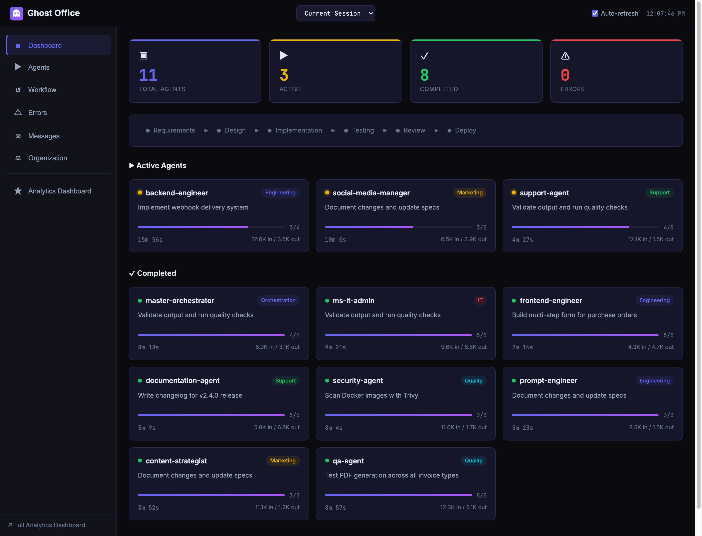
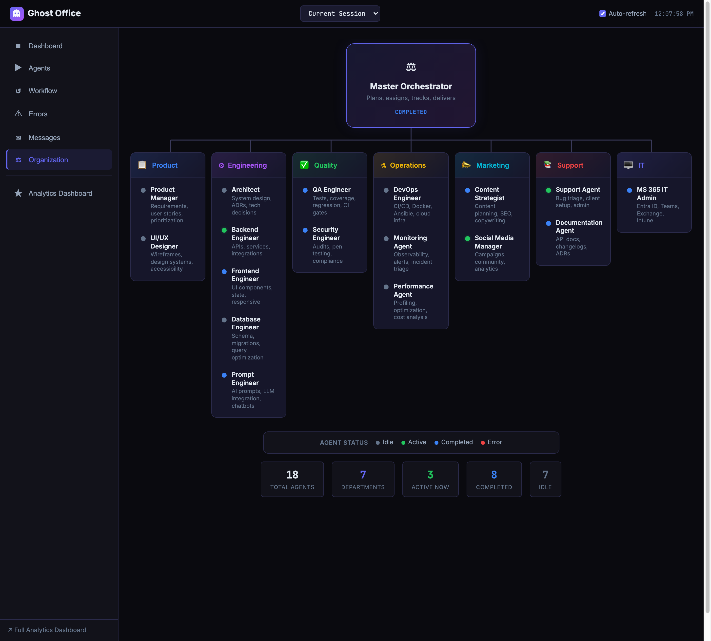
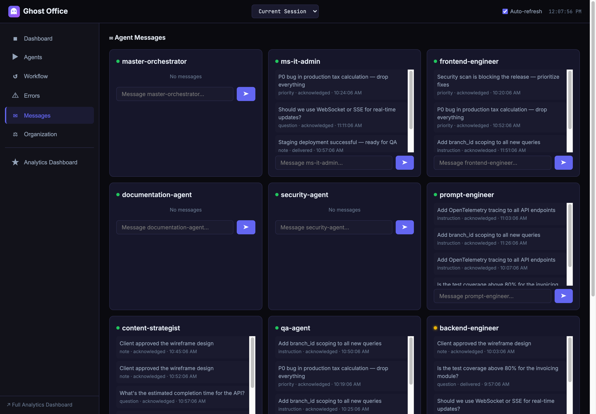
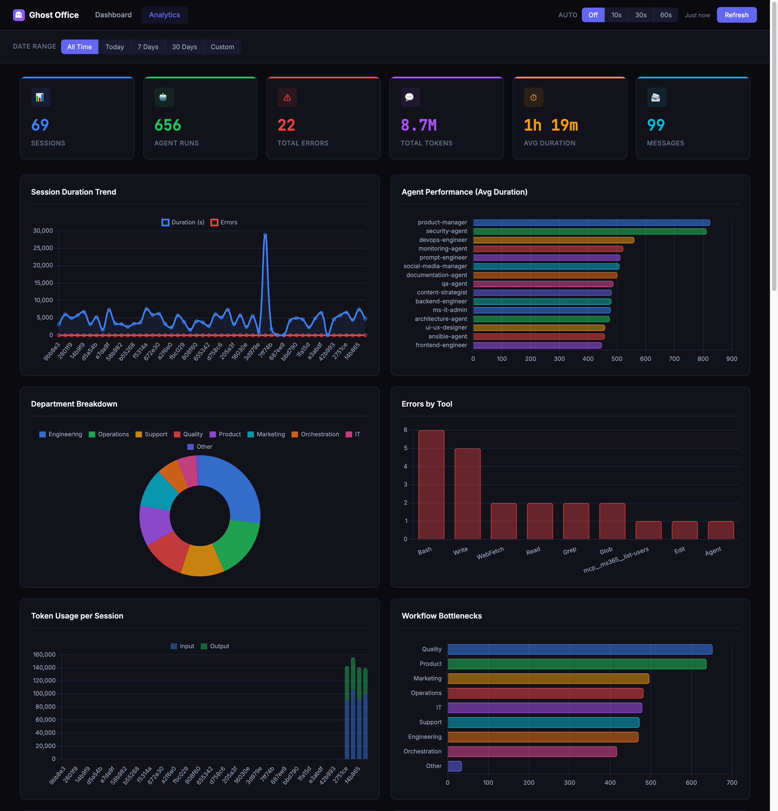

<div align="center">


# Ghost Office

### Drop a folder into any project. Get an entire engineering department.

**19 AI agents** across **7 departments** — product, engineering, quality, operations, marketing, support, and IT — all coordinated by a master orchestrator. Powered by [Claude Code](https://docs.anthropic.com/en/docs/claude-code).

[](https://opensource.org/licenses/MIT)
[](.claude/agents/)
[](.claude/skills/)
[](.claude/commands/)
[](.claude/memory/domains/)

</div>

---

## What This Does

Copy `.claude/` and `CLAUDE.md` into your project. Claude Code instantly becomes an **autonomous AI software company** — a master orchestrator breaks down your task, assigns it to specialized agents, runs quality gates, and delivers production-ready results.

```
You: /implement-feature "Add invoice PDF generation with email delivery"

Orchestrator assigns:
  → product-manager     requirements + acceptance criteria
  → architecture-agent  solution design
  → backend-engineer    API + PDF service
  → frontend-engineer   UI components
  → database-engineer   migrations (with branch_id)
  → qa-agent            tests (80%+ coverage)
  → security-agent      vulnerability review
  → devops-engineer     CI/CD pipeline
  → documentation-agent API docs + changelog

Result: Complete feature — code, tests, docs, ready to deploy.
```

**No plugins. No install. Just markdown, JSON, and shell scripts.**

---

## Setup

### Use directly
```bash
git clone https://github.com/bipinks/ghost-office.git
cd ghost-office && claude
```

### Add to your project

**Minimum:**
```bash
cp -r ghost-office/.claude/ your-project/.claude/
cp ghost-office/CLAUDE.md your-project/CLAUDE.md
```

**Full setup:**
```bash
cp -r ghost-office/.claude/ your-project/.claude/
cp ghost-office/CLAUDE.md your-project/CLAUDE.md
cp ghost-office/AGENTS.md your-project/AGENTS.md
cp ghost-office/.mcp.json your-project/.mcp.json      # MCP integrations
cp -r ghost-office/scripts/ your-project/scripts/      # Validation
cp -r ghost-office/contexts/ your-project/contexts/    # Context modes
```

Then activate your domain: `/set-domain <name>` (erp, ecommerce, saas, healthcare, fintech, education, cms) and edit `CLAUDE.md` to match your project.

---

## The Team

<table>
<tr><td align="center"><b>Department</b></td><td align="center"><b>Agents</b></td><td align="center"><b>What They Do</b></td></tr>
<tr><td><b>Product</b></td><td>product-manager, ui-ux-designer</td><td>Requirements, user stories, wireframes, design systems</td></tr>
<tr><td><b>Engineering</b></td><td>architecture, backend, frontend, database, prompt-engineer</td><td>System design, APIs, UI, schemas, AI integration</td></tr>
<tr><td><b>Quality</b></td><td>qa-agent, security-agent</td><td>Tests, security audits, OWASP, compliance</td></tr>
<tr><td><b>Operations</b></td><td>devops-engineer, laravel-forge-agent, monitoring-agent, performance-agent</td><td>CI/CD, Forge, deployments, observability, optimization</td></tr>
<tr><td><b>Marketing</b></td><td>content-strategist, social-media-manager</td><td>Content strategy, SEO, campaigns, community</td></tr>
<tr><td><b>Support</b></td><td>support-agent, documentation-agent</td><td>Issue triage, API docs, user guides, changelogs</td></tr>
<tr><td><b>IT</b></td><td>ms-it-admin</td><td>Microsoft 365, Entra ID, Teams, Exchange</td></tr>
</table>

The **master-orchestrator** coordinates everything — plans work, assigns agents, runs parallel streams, and enforces quality gates.

---

## Commands

| Command | What Happens |
|---------|-------------|
| `/implement-feature "..."` | Full lifecycle: requirements → design → code → test → docs |
| `/fix-bug "..."` | Triage → investigate → fix → regression test → deploy |
| `/deploy-production` | Security scan → staging → approval → production |
| `/forge-site "..."` | New Forge site: site → repo → DB → .env → deploy → DNS → SSL |
| `/investigate-incident "..."` | Triage → root cause → mitigation → post-mortem |
| `/security-scan` | OWASP + CIS audit, secret detection, dependency scan |
| `/analyze-project` | Architecture review, tech debt, recommendations |
| `/write-tests` | Test suite with 80%+ coverage target |
| `/create-content "..."` | Content strategy → copywriting → SEO |
| `/design-ui "..."` | Wireframes → components → accessibility audit |
| `/ai-prompt "..."` | Prompt engineering → evaluation → integration |
| `/infra-plan "..."` | Cloud architecture with Terraform |
| `/set-domain <name>` | Switch domain knowledge |
| `/agent-status` | Live agent progress and task tracking |

[All 25 commands →](.claude/commands/)

---

## Agent Dashboard

When you run `/implement-feature`, up to 9 agents work in parallel. The dashboard shows you exactly what each one is doing — in real-time, from a second terminal.

```bash
./scripts/agent-dashboard.sh              # Live overview (1s refresh)
./scripts/agent-dashboard.sh --sessions   # List all sessions, pick one
./scripts/agent-dashboard.sh --session <id> # Jump to a specific session
./scripts/agent-dashboard.sh --history    # Browse past sessions
./scripts/agent-dashboard.sh --analytics  # Per-agent performance stats
./scripts/agent-dashboard.sh --export     # Save snapshot as markdown
./scripts/agent-dashboard.sh --web        # Web UI on http://localhost:8686
./scripts/agent-dashboard.sh --web-docker # Containerized web UI via Docker
docker compose up dashboard              # Alternative: run dashboard container
```

**Multi-session:** Press `[l]` in the dashboard to switch between active and historical sessions. The web dashboard has a session selector dropdown.

**Or stay in Claude Code:** type `/agent-status` for an instant status snapshot.

---

<div align="center">

<p><i>Live dashboard — workflow progress, agent status, task tracking, all in real time</i></p>
</div>

---

### Organization — 18 agents, 7 departments

<div align="center">

<p><i>Master orchestrator coordinates specialists across Product, Engineering, Quality, Operations, Marketing, Support, and IT</i></p>
</div>

---

### Interactive messaging — talk to agents live

Send instructions, questions, and commands to agents while they work. Messages are delivered asynchronously via the `message-check` hook.

<div align="center">

<p><i>Send instructions, ask questions, adjust priorities — agents acknowledge and respond automatically</i></p>
</div>

Message types: `instruction`, `question`, `priority`, `note`, `pause`, `cancel`
Status flow: **pending** → **delivered** (hook notifies agent) → **acknowledged** (agent responds)

---

### Analytics dashboard

Cross-session analytics at `http://localhost:8686/analytics.html` — powered by SQLite and Chart.js.

<div align="center">

<p><i>Session trends, agent performance, department breakdown, error analysis, token usage, and workflow bottlenecks</i></p>
</div>

- **Auto-created**: SQLite database syncs from JSON on each request — no setup needed
- **API endpoints**: `GET /api/analytics/{summary,agent-performance,department-performance,session-trends,workflow-bottlenecks,error-breakdown,token-usage,message-stats}`

See [docs/dashboard-data-model.md](docs/dashboard-data-model.md) for the full data model and schema.

---

**How the dashboard works — no magic:**

| What you see | Where it comes from |
|---|---|
| Agent status + duration | `.claude/status/agents.json` (written by `subagent-lifecycle` hook) |
| Task progress bars | `.claude/status/todos/{agent}.json` (written by `todo-tracker` hook) |
| Workflow phase label | Inferred from which agents are currently active |
| Error indicators | `.claude/status/errors/{agent}.json` (written by `tool-failure` hook) |
| Interactive messaging | `.claude/status/messages/{agent}.json` (written by web API + `message-check` hook) |
| Session history | `.claude/status/history.json` — last 50 sessions, auto-pruned |
| Analytics / charts | `data/dashboard.db` (SQLite, synced from JSON by server.py) |
| Desktop notification | Fires via `notification` hook when all agents finish |

---

## Safety Hooks

| Hook | What It Prevents |
|------|-----------------|
| **git-safety-check** | Blocks force-push to main/master/develop/production |
| **infra-safety-check** | Warns before `terraform destroy`, `kubectl delete`, `rm -rf` |
| **file-write-check** | Scans every write for hardcoded secrets and API keys |
| **migration-check** | Enforces `branch_id` in all migrations (multi-tenant) |
| **ms365-audit-log** | Logs all Microsoft 365 operations for compliance |
| **todo-tracker** | Captures per-agent task progress for the dashboard |
| **tool-failure** | Logs tool failures, tracks errors per agent |
| **subagent-lifecycle** | Tracks agent start/stop, session history, notifications |
| **message-check** | Delivers dashboard messages to agents on every tool use |
| **session-start** | Auto-injects project context on every session |
| **pre-compact** | Preserves critical context before auto-compaction |

Plus deny rules blocking `DROP DATABASE`, `rm -rf /`, and force-push to protected branches.

---

## 53 Skills

Agents reference deep knowledge packs — not guessing, applying proven patterns:

**Infrastructure**: AWS, Terraform, Kubernetes, Docker, Ansible, Nginx, Networking
**Backend**: Laravel, API Design, Authentication, Multi-tenancy, PostgreSQL, Redis
**Frontend**: Vue 3, TypeScript, Component Patterns, Accessibility, Design Systems
**Quality**: Testing, Security Hardening, Secrets Management, SSL/TLS
**Operations**: CI/CD, GitHub Actions, Monitoring, Log Management, Backup/DR
**AI/ML**: Prompt Design, LLM Integration, Conversational AI, AI Evaluation
**Marketing**: SEO, Content Strategy, Copywriting, Email Marketing, Paid Ads, Social Media, Analytics
**Product**: Product Management, UX Research, Wireframing

---

## 6 Workflows

| Workflow | Flow |
|----------|------|
| **Feature Development** | Requirements → Design → Implement (parallel) → Test → Review → Deploy |
| **Bug Fix** | Triage → Investigate → Fix → Regression Test → Deploy |
| **Release Process** | Freeze → QA → Security → Staging → Approval → Production |
| **Production Incident** | Detect → Triage → Investigate → Mitigate → Resolve → Post-mortem |
| **Client Deployment** | Requirements → Tenant → Config → Data → Deploy → Verify |
| **Content Campaign** | Strategy → Create → SEO Optimize → Publish → Analyze |

---

## 7 Domain Templates

Switch domain knowledge with `/set-domain <name>`:

| Domain | What You Get |
|--------|-------------|
| **ERP** | Accounting, inventory, sales, HR, procurement, manufacturing |
| **E-Commerce** | Catalog, cart, checkout, orders, payments, shipping |
| **SaaS** | Subscriptions, billing, feature flags, onboarding |
| **Healthcare** | EHR, HIPAA compliance, HL7 FHIR, clinical workflows |
| **Fintech** | Payments, ledger, KYC/AML, fraud detection, PCI DSS |
| **Education** | Courses, assessments, LMS, FERPA/COPPA compliance |
| **CMS** | Content authoring, SEO, headless API, localization |

---

## Architecture

```
your-project/
├── .claude/                 Auto-discovered by Claude Code
│   ├── agents/              19 agents (1 orchestrator + 18 specialists)
│   ├── commands/            25 slash commands
│   ├── workflows/           6 workflow definitions
│   ├── memory/              6 knowledge docs + 7 domain templates
│   ├── skills/              54 domain knowledge packs
│   ├── rules/               12 guidelines (7 categories)
│   ├── hooks/               13 safety/audit/lifecycle hooks
│   ├── status/              Runtime: agent status, todos, errors, history
│   └── settings.json        Permissions, hooks, autonomous config
├── scripts/
│   ├── agent-dashboard.sh   Terminal dashboard (live + history + analytics)
│   └── web/
│       ├── dashboard.html   Web dashboard (dark theme, auto-refresh)
│       ├── analytics.html   Analytics dashboard (charts, SQLite-backed)
│       └── server.py        Web server (JSON sync, SQLite, analytics API)
├── CLAUDE.md                Project instructions (loaded every session)
├── AGENTS.md                Agent roster and orchestration
└── .mcp.json                MCP connections (GitHub, AWS, MS365, etc.)
```

**No plugins. No dependencies. No build step.** Pure markdown, JSON, and shell scripts.

---

## MCP Integrations

Pre-configured connections (enable what you need): GitHub, AWS, Cloudflare, Vercel, Supabase, Docker, Kubernetes, Microsoft 365, Filesystem.

---

## Requirements

- [Claude Code CLI](https://docs.anthropic.com/en/docs/claude-code)
- Node.js 18+ (for validation scripts)
- CLI tools as needed: `terraform`, `kubectl`, `docker`, `aws`, `gh`

---

## Learn More

- **[Beginner's Guide](BEGINNERS-GUIDE.md)** — New to DevOps? Start here
- **[Agent Reference](AGENTS.md)** — Full roster and orchestration details
- **[Architecture Report](docs/architecture_report.md)** — System overview
- **[Contributing](CONTRIBUTING.md)** — How to add agents, skills, commands, and rules

---

## License

MIT License — see [LICENSE](LICENSE) for details.

Built by [Bipin Kareparambil](https://github.com/bipinks).
